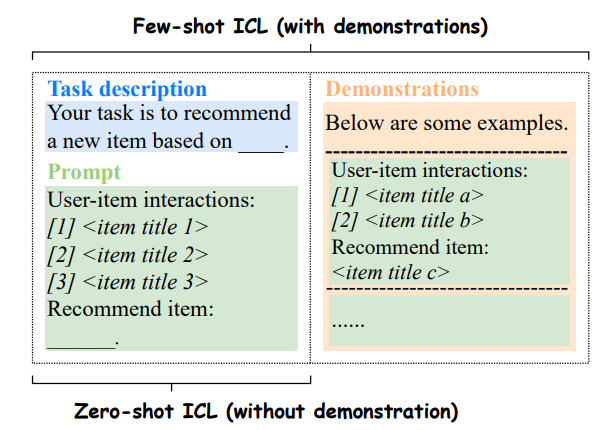

A July 2023 survey that analyzes the solutions (existing and non-existing) with which LLMs can be used to make recommendations.

Three ways of using LLMs are distinguished:

- **Pre-trained** → Training an LLM on one or more recommender datasets. De facto, they are SLMs.

- **Fine-tuning** → Refinement of an LLM for a specific purpose. Two techniques are distinguished:
    - **Full-model Fine-tuning (FMFT)**: All model parameters are re-weighted. Lots of data and VRAM are required.
    - **Parameter-efficient Fine-tuning (PEFT)**: Only a few adapters are trained through specific frameworks, which allow the model to have performance comparable to that of the Full-model. The most used framework is [LoRA]( "Lora: Low-Rank Adaptation of Large Language Models")

- **Prompting** → Not update the LLM weights but adapting the model to a task via task-specific prompts. Three paradigms are distinguished in LLMs and recommender approch:

	- **Prompting**: 

		- **Conventional Prompting**:  This has not been explored because it consists of asking the model for a recommendation without any prior steps.
		- **In-Context Learning (ICL)**: This has been explored in zero-shot and few-shot settings.
			
		- **Chain-of-Thought (CoT)**: This suggests the model to think step by step. This strategy has also been explored in two settings: zero-shot and few-shot (where the output example is followed by a description of steps).
	
    - **Prompt Tuning**: Instead of manually prompting, use a model to maximize model efficiency. There are two strategies:

		- **Hard Prompt Tuning**: Use a generative model to update the text templates of the prompt (using NLP).
		- **Soft Prompt Tuning**: Use text embedding and continuous vectors to represent the prompt. The embedding can be updated using gradient methods and task-specific information.

Among the works cited:

- [M6-Rec]( "M6-Rec: Generative Pretrained Language Models are Open-Ended Recommender Systems"): Pre-trained model (M6) on which zero-shot is evaluated. According to the authors, it is more performant than Fine-tuning.
- [P5]( "P5: Recommendation as Language Processing (RLP)"): Pre-trained model trained on various recommendation datasets. The model should be general and work zero-shot.
- [RecLLM]( "RecLLM: Leveraging Large Language Models in Conversational Recommender Systems"): Application of an LLM in the conversational context. More alternatives are provided to integrate the "recommender engine" with the LLM. All the work is based on dialogue simulation. The domain is given by YouTube videos (no evaluation). One solution is Fine-tuning (FMFT).
- [TALLRec]( "TALLRec: Efficient Tuning Framework to Align LLM with Recommendation"): Application of PEFT to the LLaMA-7B model (the smallest). It is interesting that the fine-tuning is performed on a 3090. One of the evaluation dataset is MovieLens. The code is provided.